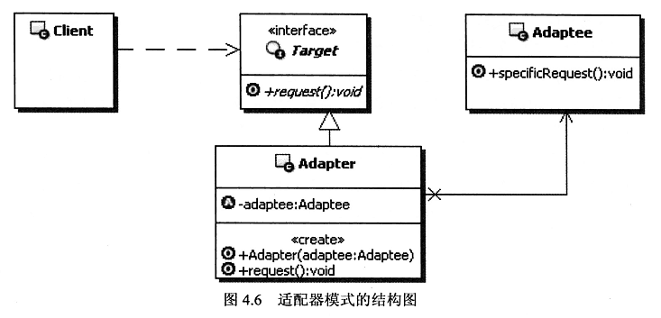
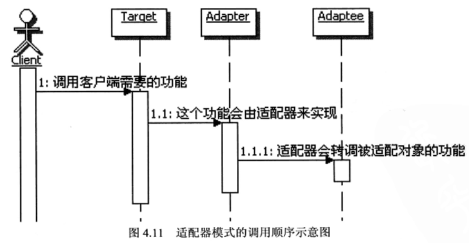

#### **适配器模式**
适配器模式（Adapter Pattern）是作为两个不兼容的接口之间的桥梁。这种类型的设计模式属于结构型模式，它结合了两个独立接口的功能。这种模式涉及到一个单一的类，该类负责加入独立的或不兼容的接口功能。

##### 结构示意图

+ Client：客户端，调用自己需要的领域接口Target。
+ Target：定义客户端需要的跟特定领域相关的接口。
+ Adaptee：已经存在的接口，通常能满足客户端的功能要求，但是接口与客户端要求的特定领域接口不一致，需要**被适配**。
+ Adapter：适配器，吧Adaptee适配成为Client需要的Target。

##### 调用示意图
+ 调用顺序示意图

##### 优点
    1、可以让任何两个没有关联的类一起运行。 
    2、提高了类的复用。 
    3、增加了类的透明度。 
    4、灵活性好。

##### 缺点 
    1、过多地使用适配器，会让系统非常零乱，不易整体进行把握。比如，明明看到调用的是 A 接口，其实内部被适配成了 B 接口的实现，一个系统如果太多出现这种情况，无异于一场灾难。因此如果不是很有必要，可以不使用适配器，而是直接对系统进行重构。 
    2.由于 JAVA 至多继承一个类，所以至多只能适配一个适配者类，而且目标类必须是抽象类。
    
