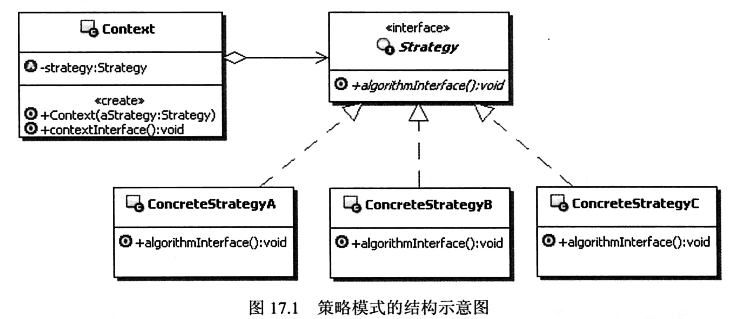
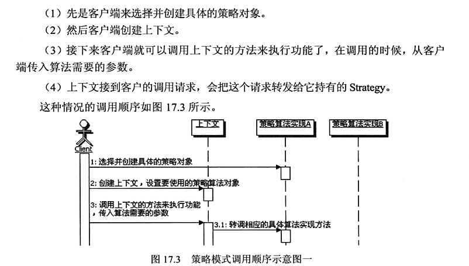
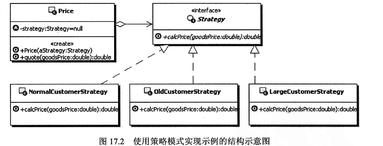

#### **策略模式**

在策略模式（Strategy Pattern）中，一个类的行为或其算法可以在运行时更改。这种类型的设计模式属于行为型模式。
在策略模式中，我们创建表示各种策略的对象和一个行为随着策略对象改变而改变的 context 对象。策略对象改变 context 对象的执行算法。

#####结构示意图

+ Strategy: 策略接口，用来约束一系列具体的策略算法。Context使用这个接口来调用具体的策略实现定义算法。
+ ConcreteStrategu：具体的策略实现，也就是具体的算法实现。
+ Context：上下文，复制和具体的策略类交互。通常上下文会持有一个真正的策略实现，上下文还可以让具体的策略类来获取上下文的数据，甚至让具体的策略类来回调上下文的方法。

#####调用示意图
+ 调用示意图1 - example1

+ 调用示意图2

##### 优点
    1、算法可以自由切换。 
    2、避免使用多重条件判断。
    3、扩展性良好。
    
##### 缺点
     1、策略类会增多。 
     2、所有策略类都需要对外暴露。
     
##### 使用场景
     1、如果在一个系统里面有许多类，它们之间的区别仅在于它们的行为，那么使用策略模式可以动态地让一个对象在许多行为中选择一种行为。 
     2、一个系统需要动态地在几种算法中选择一种。 
     3、如果一个对象有很多的行为，如果不用恰当的模式，这些行为就只好使用多重的条件选择语句来实现。
     4、解决的大量得if-else

##### 示例
+ example1：报价管理，不同客户给与不同的报价。

